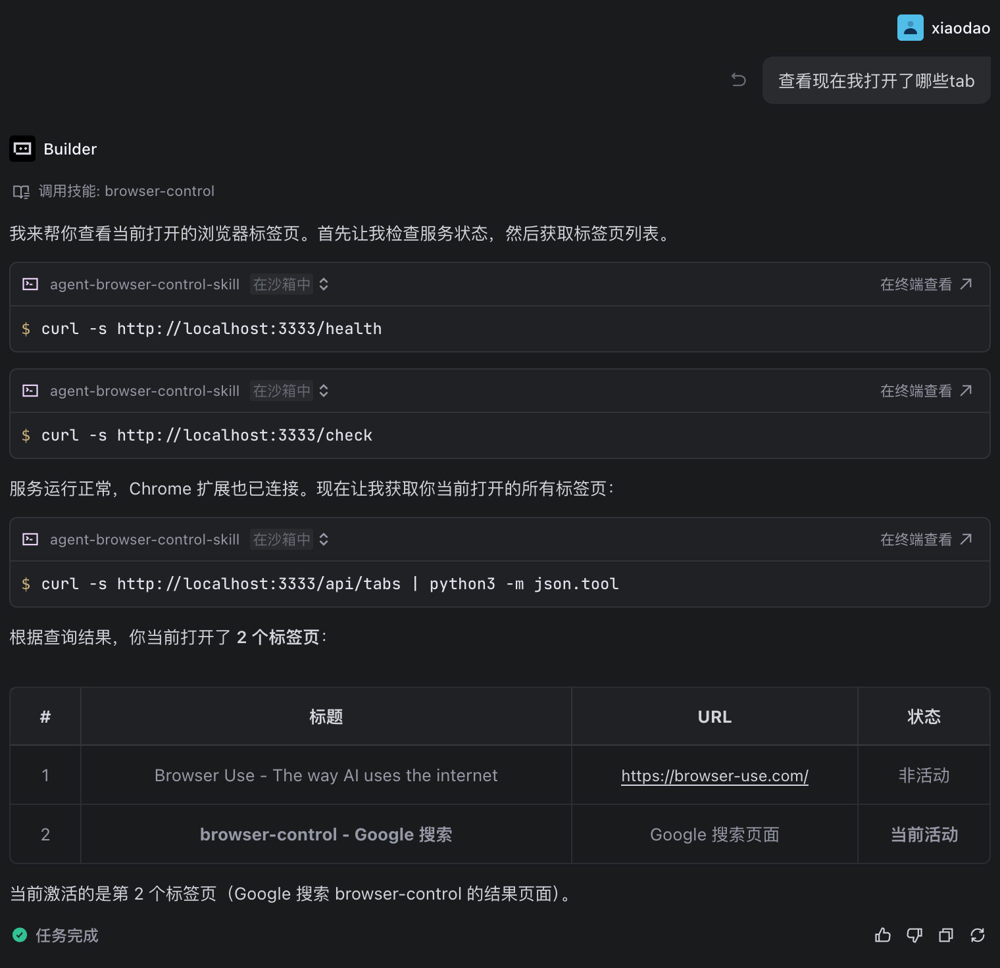
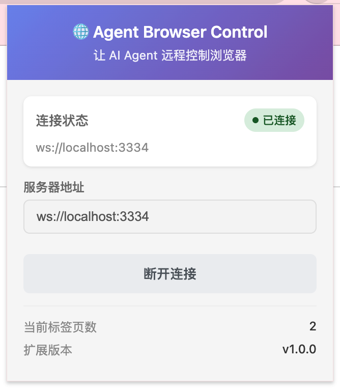
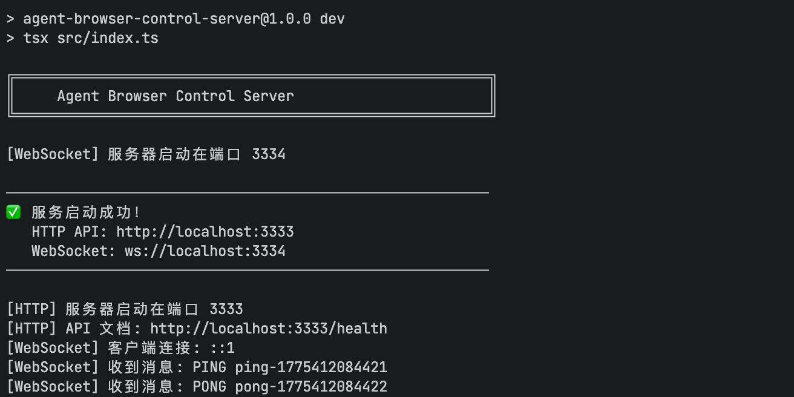

# agent-browser-control-skill

基于 Chrome 浏览器插件的 Agent Browser Control Skill，让 AI Agent 能够远程控制浏览器进行自动化操作。

## 与 browser-use 的核心区别

### 本质差异

| | browser-use | browser-control-skill |
|---|---|---|
| **核心定位** | 让 AI **拥有**一个独立的浏览器 | 让 AI **接管**你正在使用的浏览器 |
| **浏览器实例** | 启动一个全新的浏览器进程 | 连接到你已有的 Chrome 浏览器 |
| **用户视角** | AI 在后台操作，你看不到 | AI 在你的浏览器上操作，你实时可见 |

### 详细对比

| 特性 | browser-use | browser-control-skill |
|------|-------------|----------------------|
| **控制方式** | Python 库直接控制浏览器 | Chrome 插件 + 本地服务 + HTTP API |
| **浏览器支持** | Playwright/Selenium 支持的所有浏览器 | 仅 Chrome（通过插件） |
| **权限获取** | 受限于 Playwright 沙箱 | 继承用户 Chrome 的所有权限（登录态、Cookie、插件等） |
| **内容获取** | 标准页面内容 | 可获取 Chrome 扩展能访问的所有内容（包括需要登录的页面） |
| **使用方式** | 代码调用，适合脚本/程序 | HTTP API，适合任意 Agent 调用 |
| **运行环境** | 需要完整的 Python 环境 | 仅需 Node.js 运行服务 |
| **适用场景** | 自动化测试、爬虫、脚本 | Agent 集成、远程控制、辅助用户浏览 |

### 选择建议

**使用 browser-use，如果你需要：**
- 让 AI 独立完成网页任务（如自动化测试、数据采集）
- 不需要访问你个人的登录态和浏览器数据
- 在服务器/云端运行，无需人工干预

**使用 browser-control-skill，如果你需要：**
- 让 AI 协助你处理当前正在浏览的网页
- AI 需要访问你已登录的网站（如帮你整理已打开的 GitHub 页面）
- 你想实时看到 AI 的操作，随时接管控制
- 利用 Chrome 插件获取更高的页面访问权限

## 架构概述

本项目采用三层架构设计：

```
┌─────────────────────────────────────────────────────────────────┐
│                        AI Agent                                 │
│                    (通过 Skill 调用)                             │
└───────────────────────┬─────────────────────────────────────────┘
                        │ HTTP API
                        ▼
┌─────────────────────────────────────────────────────────────────┐
│                     Local Server                                │
│              (Node.js + WebSocket + HTTP)                       │
└───────────────────────┬─────────────────────────────────────────┘
                        │ WebSocket
                        ▼
┌─────────────────────────────────────────────────────────────────┐
│                  Chrome Extension                               │
│              (Vite + React + TypeScript)                        │
└─────────────────────────────────────────────────────────────────┘
```

### 核心组件

1. **Chrome Extension** (`chrome-extension-src/`)
   - 技术栈：Vite + React + TypeScript
   - 构建输出：`chrome-extension-dist/`
   - 功能：与浏览器原生 API 交互，管理标签页、执行脚本等

2. **Local Server** (`server/`)
   - 技术栈：Node.js + Express + WebSocket
   - 功能：
     - 与 Chrome Extension 建立 WebSocket 连接
     - 对外暴露 HTTP API 供 Agent 调用
     - 消息转发和协议转换

3. **Skill** (`browser-control-skill/`)
   - 提供给 Agent 使用的技能定义文档
   - 包含完整的能力清单、API 接口描述和使用示例

## 使用教程

### 方式一：Agent 安装 Skill（推荐）

将 `browser-control-skill/` 文件夹压缩成 ZIP 文件，提供给 Agent 安装：

```bash
# 压缩 skill 文件夹
zip -r browser-control-skill.zip browser-control-skill/
```

然后在你的 Agent 平台中上传 `browser-control-skill.zip` 文件进行安装。

### 方式二：手动配置

将 `browser-control-skill/SKILL.md` 文件的内容复制到你的 Agent 配置中。

---

## 环境搭建

在使用本 Skill 之前，需要先搭建本地环境：

### 1. 安装 Chrome 插件

```bash
cd chrome-extension-src
npm install
npm run build
```

构建完成后，在 Chrome 浏览器中加载 `chrome-extension-dist` 文件夹：
1. 打开 Chrome 扩展管理页面：`chrome://extensions/`
2. 开启「开发者模式」
3. 点击「加载已解压的扩展程序」
4. 选择 `chrome-extension-dist` 文件夹

### 2. 启动本地服务

```bash
cd server
npm install
npm run dev
```

服务默认监听端口：
- HTTP API: `3333`
- WebSocket: `3334`

#### 端口占用检查

如果启动服务时提示端口被占用，可以使用以下命令查找并终止占用进程：

```bash
# 查找占用 3333 端口的进程
lsof -ti:3333

# 查找占用 3334 端口的进程
lsof -ti:3334

# 终止占用 3333 端口的进程
kill -9 $(lsof -ti:3333)

# 终止占用 3334 端口的进程
kill -9 $(lsof -ti:3334)

# 或者使用组合命令同时处理两个端口
kill -9 $(lsof -ti:3333,3334)
```

### 3. 连接扩展

1. 点击 Chrome 工具栏的扩展图标
2. 点击「连接服务器」按钮
3. 等待连接成功（状态变为「已连接」）

---

## 示例效果

### Agent 使用 Skill 控制浏览器



### Chrome 扩展连接状态



### 本地服务运行状态



---

## 项目结构

```
agent-browser-control-skill/
├── browser-control-skill/     # Agent Skill（可压缩成 ZIP 安装）
│   └── SKILL.md               # Skill 定义文件
├── chrome-extension-src/      # Chrome 插件源码
│   ├── src/
│   │   ├── types.ts          # 类型定义
│   │   ├── config.ts         # 统一配置
│   │   ├── websocket.ts      # WebSocket 客户端
│   │   ├── tabs.ts           # 标签页管理
│   │   ├── background.ts     # Service Worker
│   │   ├── content.ts        # Content Script
│   │   └── popup.tsx         # Popup UI
│   ├── public/icons/         # 图标资源
│   ├── popup.html
│   ├── manifest.json
│   ├── vite.config.ts
│   ├── tsconfig.json
│   └── package.json
├── chrome-extension-dist/     # Chrome 插件构建输出（由 vite 生成）
├── server/                    # 本地服务端
│   ├── src/
│   │   ├── index.ts          # 服务入口
│   │   ├── http-server.ts    # HTTP API 服务
│   │   ├── websocket-server.ts # WebSocket 服务
│   │   └── types.ts          # 类型定义
│   ├── dist/                 # 构建输出
│   ├── tsconfig.json
│   └── package.json
├── README.md
└── LICENSE
```

## For Developer

### 开发须知

本项目由三个独立模块组成，开发时需要注意以下约定：

#### 1. 端口配置

端口已**写死**，不可随意更改：
- **HTTP API**: `3333`
- **WebSocket**: `3334`

如需修改端口，必须同时修改以下文件并保持统一：
- `server/src/index.ts` - Server 监听端口
- `chrome-extension-src/src/config.ts` - 扩展统一配置
- `browser-control-skill/browser-control.skill` - Skill 文档中的 API 地址

#### 2. 接口字段约定

**WebSocket 消息格式**（三个模块必须统一）：
```typescript
interface WSMessage {
  id: string;       // 消息唯一标识，用于请求-响应匹配
  type: string;     // 消息类型，如 'GET_TABS', 'OPEN_TAB'
  payload?: unknown; // 消息数据
  error?: string;   // 错误信息
}
```

**修改接口字段时，必须同步更新：**
1. `server/src/types.ts` - Server 类型定义
2. `chrome-extension-src/src/types.ts` - 扩展类型定义
3. `server/src/http-server.ts` - HTTP 路由处理
4. `server/src/websocket-server.ts` - WebSocket 消息处理
5. `chrome-extension-src/src/background.ts` - 消息处理器
6. `browser-control-skill/browser-control.skill` - Skill 文档

#### 3. 消息类型命名规范

所有消息类型使用**大写下划线**格式：
- `GET_TABS` / `GET_TABS_RESPONSE`
- `OPEN_TAB` / `OPEN_TAB_RESPONSE`
- `ACTIVATE_TAB` / `ACTIVATE_TAB_RESPONSE`

新增消息类型时，必须成对定义（请求 + 响应）。

#### 4. 开发流程建议

1. **修改 Server 接口**
   - 先更新 `server/src/types.ts` 类型定义
   - 实现 `http-server.ts` 路由
   - 实现 `websocket-server.ts` 消息转发
   - 更新 `browser-control-skill/SKILL.md` 文档
   - **更新 `README.md` 相关说明**（如新增接口、修改端口、项目结构等）

2. **修改扩展功能**
   - 先更新 `chrome-extension-src/src/types.ts` 类型定义
   - 实现 `tabs.ts` 中的浏览器操作
   - 在 `background.ts` 中添加消息处理器
   - 如需 UI 更新，修改 `popup.tsx`
   - **更新 `README.md` 相关说明**（如新增功能、修改配置、项目结构等）

3. **测试验证**
   ```bash
   # 1. 构建扩展
   cd chrome-extension-src && npm run build
   
   # 2. 启动服务
   cd server && npm run dev
   
   # 3. 加载扩展并连接
   # 4. 使用 curl 或 Agent 测试 API
   ```

#### 5. 版本兼容性

三个模块的版本应当保持一致：
- 修改 API 时，同步更新 `package.json` 中的 `version`
- 破坏性变更需要更新 major 版本号
- 在 `browser-control-skill/SKILL.md` 中记录变更日志

## 贡献指南

欢迎提交 Issue 和 Pull Request！

## 许可证

[Apache License 2.0](LICENSE)
